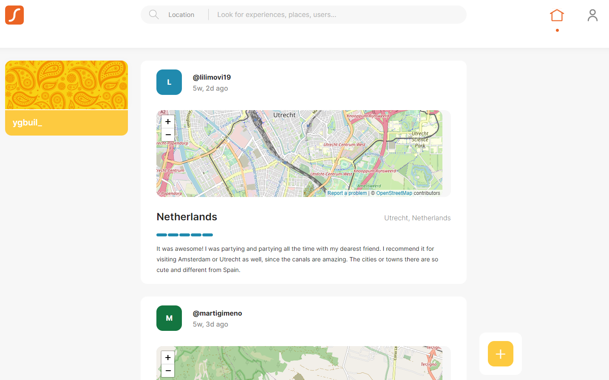

# Backend-FastAPI

## What is Xplorer?
Xplorer is a social media travel app where you can share the places you have visited on your trips with other app members, see where your friends have traveled, and keep all your travel experiences stored in your profile. I developed this project in collaboration with Martí, a friend of mine. He was in charge of the frontend, developed with Vue.js, and I developed the backend using with FastAPI, which is what the content of this repository is.

## Features

It features all common operations of a social media CRUD app:
* A register and log in system based on OAuth 2.0.
* A general feed and personal profile.
* Possibility of creating, reading, updating and deleting your experiences, personal user information...
* Integrated maps API, autocomplete features, a rating system...
* Test coverage.

Here are some snippeds of how the app looks like:

* Feed:

* Log in page:
![![Alt text]](images/log_in.png)

* Post experience page:
![![Alt text]](images/post_experience.png)

## How to use it

* Open the project and `Rebuild in Container`. All dependecies and databases will be built automatically.
* To inspect the databases, run on terminal:
    - Principal DB: `psql $DATABASE_URL` 
    - Test DB: `psql $DATABASE_URL_TEST`
